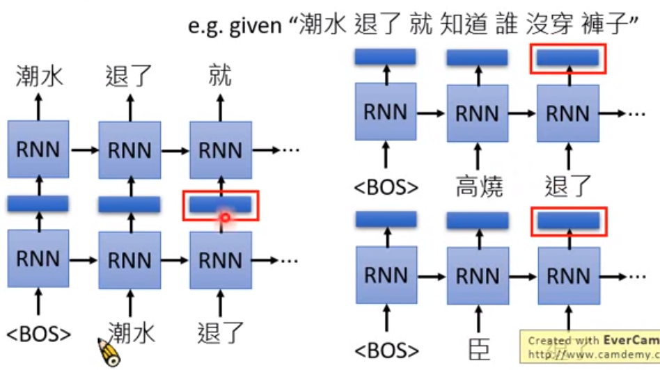
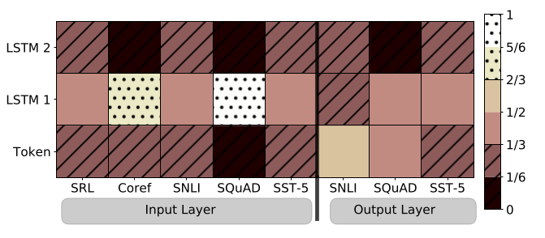
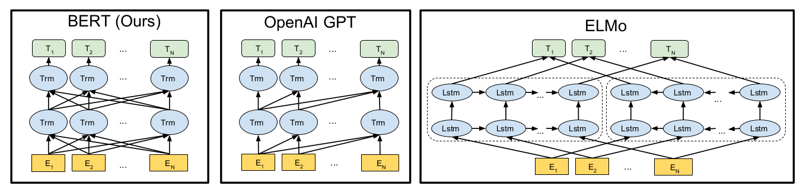
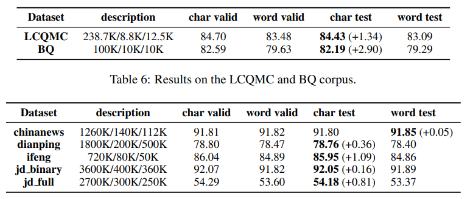
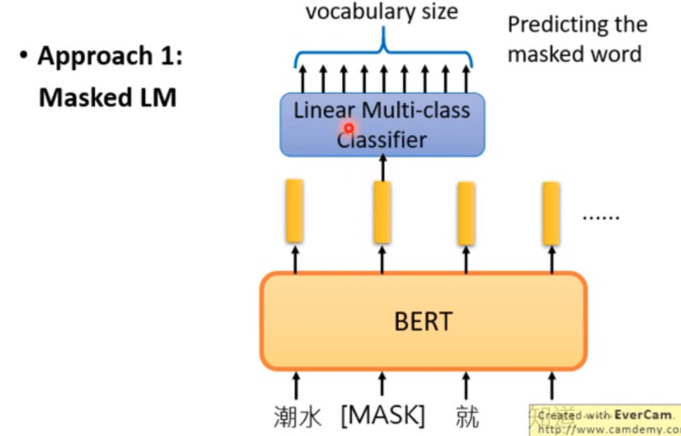
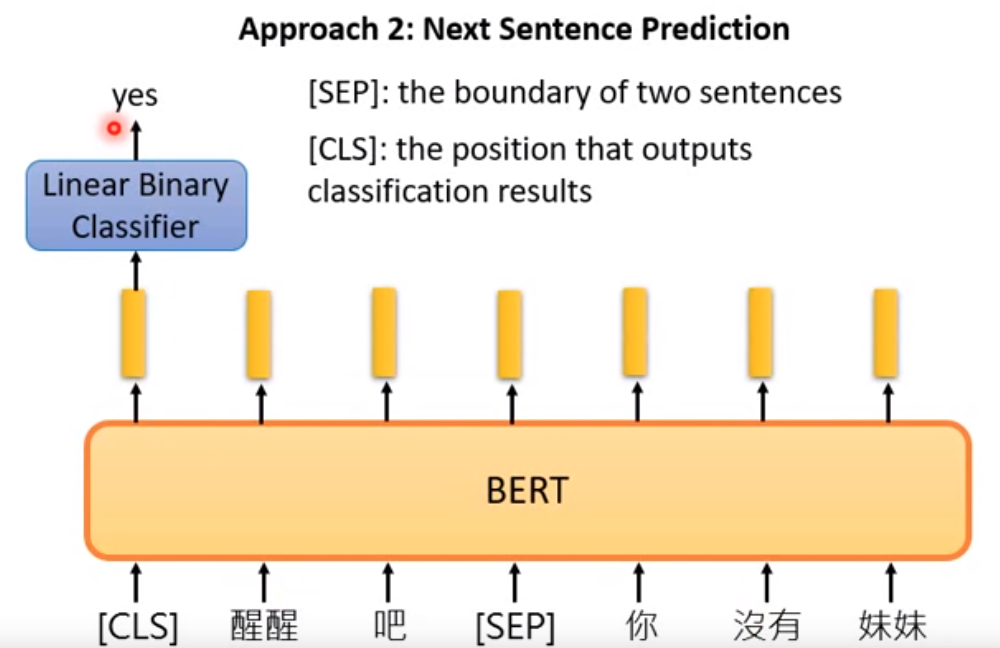

# BERT

## 1-of-N Encoding
处理nlp任务，最常见的方法之一，将字符/词来进行onehot编码。缺点就是独立的看各个词，失去了词与词意义间的联系。

## Word Embedding
一是使用word2vec， skip-gram or cbow的方法，来训练一个dense的词向量。二是结合一些比如RNN等模型，实现端到端的词向量训练。词向量能够一定程度的表达语义。

## Contextualized Word Embedding

实际生活中，一个词往往有多种含意。比如有些语境下面，“蔡徐坤”是一个人名。有些语境下面，“蔡徐坤”是一个形容词。想仅仅通过一个向量来表达多义词，往往比较困难。

这里就需要一种新的技术来表达词向量，我们希望每一个token，在不同的context下，都有各自不同的embedding。

### 1. ELMO (Embeddings from Language Model)

参数量： 94M

RNN based language model。 从大量的句子中训练。每个词的embedding都由其上下文来共同作用而产生（双向RNN）。

#### 多层RNN
ELMO使用多层RNN,把隐含层的所有embedding按weight相加。weight由下游任务训练得出。不同的任务，需要不同深度的embedding特征。

## BERT (Bidirectional Encoder Representations from Transformer)
参数量： 340M

BERT 其实就是[Transformer](/transformer)的Encoder部分。

BERT = Encoder of Transformer

### 不需要中文分词
BERT不需要做中文分词的。不像以往的一些NLP任务，起手就首先需要对语料进行分词。

中文分词会带来一些问题，主要有几个方面，一个是分词不准确，断句不精准。比如“小龙女说我也想过过过儿过过的生活”，“校长说衣服上除了校徽别别别的 ”。 类似的句子还挺有意思的，网上一查有很多。另一个方面就是未登录词，词实在是太多了，总归有些在你语料没有出现过的。还有就是命名实体的识别，人名，地名，建筑名等等，没有一个完美的方案来解决这个问题。

目前反倒是没有做过分词的BERT，在一些中文数据集上也取得了非常好的效果。

那么自然就产生了一个问题，中文分词是否真的还有必要？ACL 2019 还收录了一篇论文就是讨论这个问题的：《Is Word Segmentation Necessary for Deep Learning of Chinese Representations》。比较下来基于字的效果要比分词的效果更好。

### BERT训练

google设计了两个unsupervised task, 共同来训练bert。Bertbase 就是使用了相同的数据，相同的调参方法，相同的参数，同时训练了这两个任务得到的。
#### 任务一： MLM (Masked LM)
随机使用[mask]覆盖一些token。同时要求一个linear classifier 在词表中找到被masked的那个token。期望的效果就是：如果几个token在同一个语境下可以相互替代，那么这几个token就应该是近义词。

#### 任务二： NSP (Next Sentence Prediction)
在两个句子中添加 [SEP]符号来表示前后两个句子的交界。由上一个句子的输入，来判断下面的句子是否合理。在两个句子开头添加[CLS]符号，通过一个binary classifier来判断是否这两个句子应该被接在一起。

