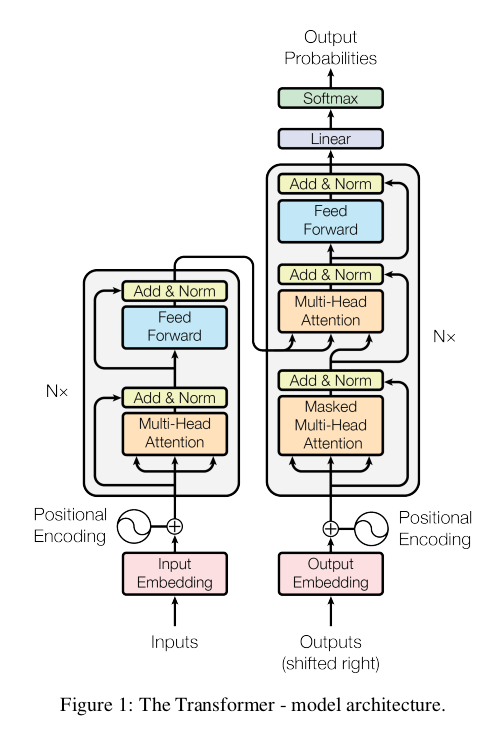
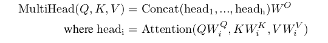
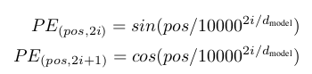
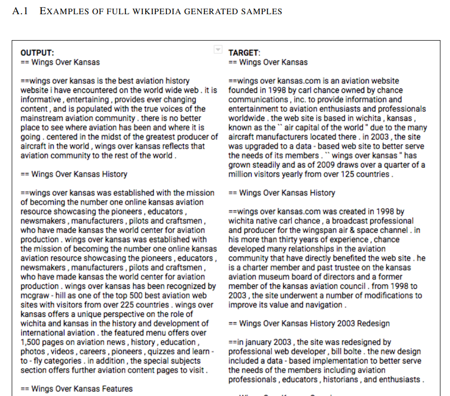

# Transformer

相关论文是: [Attention Is All You Need](https://github.com/wangruichens/papers-machinelearning/blob/master/nlp/Attention%20Is%20All%20You%20Need.pdf)

论文主要几个关键点 : 
* Replace RNN with attention
* Scaled dot production 
* Multi head attention
* Position representation

在以往，RNN结构有一个突出的问题，比较难以并行化，需要序列化计算。一个解决办法是替换rnn模块为cnn。
通过调整cnn的kernel大小，也可以实现一个node同时观察序列多个位置的效果。

Transformer 也可以叫 Self Attention Layer。也是为了解决 rnn 而提出来的。理论上可以替换任何rnn based模型。
我们从基础的模块讲起

## Scaled Dot-Production Attention

每一个input X 由三个值共同表达， 分别是Q,K,V。

- Query (to match others)
- Key (to be matched)
- Value (information to be extracted)

首先，对于pos1位置的token, 有Q1 × Ki 得到位于pos i的权重。再加上softmax()以后，按相对应的比例取对应tokeni的Value。

比较直观的图。

最后得出的 bj = &Sigma; aj,i vi
对每一个token,都可以同时计算所有的b。每一个token都同时关注了所有的其他结点。
没提到的&radic;d 是一个scaling参数。论文中说的是，越大的维度，乘法以后magnitude越大，导致通过softmax以后梯度消失。加上一个d来抵消这种效果。

attention的效果，可以看到它可以学出it在不同语境下的代指。

## Multi-Head Attention

只有一个全局的attention机制，不如采用多组attention，同样可以进行并行计算。这样能够让模型更容易学习到每个位置token的不同表达。用一个全局的attention等于全局平均了这个效果。

## Position representation

到此为止，我们发现模型并没有输入位置信息，所有位置的token都是等价的。论文中采用一种加法的方式。每个 input encoding 加上 ‘position encoding’。

采用这个方法的主要原因是因为这样也许可以让模型更方便的学习位置的相对关系。PEpos + k可以由 PEpos线性表示。 
对于奇偶数位置的pos分别编码。 因为pi是一个无理数，所以不存在两个不同位置拥有相同的编码。

为什么是sum 而不是 append ? 可以证明 sum 和append 在最后矩阵运算中是等价的。

论文也尝试了训练好的位置编码，发现两种方法对于结果影响区别不大。

## 延伸应用
attention 在图像上的应用。

使用 transform可以训练写wiki。输入是1M量级的词，输出是1K量级。以前的rnn基本做不到这样量级的训练。一方面体现了transformer的简单与有效性。

